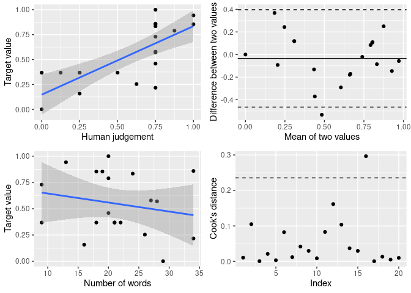

```{r xaringanExtra, echo = FALSE}
xaringanExtra::use_tile_view()
xaringanExtra::use_animate_all(params$animation)
xaringanExtra::use_logo(image_url = "img/mzes_logo.png", width = 280)
mzesalike::use_footer(params)
```

# 1. Domain specificity

.pull-left[

.large[
* My cat is *bad*. (-1)

* meine katze ist im *bad* (-1)

* mijn kat *bad* voor je (-1)

* my cat's **advantages** **trump** all *disadvantages* (+1)
]]

.pull-right[

```{r, echo = FALSE, message = FALSE, out.width = "300px"}

```
.extrasmall[(Liu 2015.)]

]

---

```{r, message = FALSE}
require(quanteda)
require(quanteda.dictionaries)
documents <- c(trump = "trump is bad",
               biden = "biden is bad")
dfm_lookup(dfm(documents),
           dictionary = data_dictionary_HuLiu)
```

---

# 2. Bag of words

.large[
* my cat is *bad* (-1)

* is my cat *bad* ? (-1)

* cat *bad* is my (-1)

* biden is **good** but **trump** is *bad* (+1)
]

---
# 3. Additivity

.large[
* my cat is *bad* (-1)

* my cat is very *bad* (-1)

* my cat is not *bad* (-1)

* my cat is *bad bad* (-2)

* meine katze *war* im *bad* ... *bad*. jetzt ist sie ... äh ... noch im *bad*. (-4)

* mijn kat *bad* en *bad* en God luistert eindelijk naar haar. (-2)
]

---

# Limited validity

.pull-left[
```{r, echo = FALSE, message = FALSE, out.width = "600px"}

```

.extrasmall[Young & Soroka, 2012; Gilbert & Hutto, 2014; González-Bailón & Paltoglou, 2015; Ribeiro et al. 2016; Boukes et al. 2020]

]

.pull-right[
```{r, echo = FALSE, message = FALSE, out.width = "600px"}

```

.large[**Chan et al. (2020)**]

]


---

# The solution: step 1 of n

.pull-left[

Validate, Validate, Validate

-   Statistical validation

-   Predictive validation

-   **Semantic validation**

(DiMaggio et al. 2013; Grimmer & Stewart. 2013; Chan & Sältzer, 2020)

```{r, echo = FALSE, message = FALSE, out.width = "150px"}
knitr::include_graphics("img/oolong_logo.png")
```

]

.pull-right[


```{r, echo = FALSE, message = FALSE, out.width = "500px"}

```

]

---
class: inverse, middle, center

# these 3 assumptions (domain specificity, bag of words and additivity) are remarkably delicate -  incredibly unreal, streamlined in thoughtfulness, and defeating its shiny promises. use these simplified methods with care.

---

```{r, message = FALSE}
document <- "these 3 assumptions (domain specificity,
bag of words and additivity)  are remarkably
delicate -  incredibly unreal, streamlined in 
thoughtfulness, and defeating its shiny promises.
use these simplified methods with care."
dfm_lookup(dfm(document,
               ),dictionary = data_dictionary_HuLiu)

## Thanks for having me.
```
